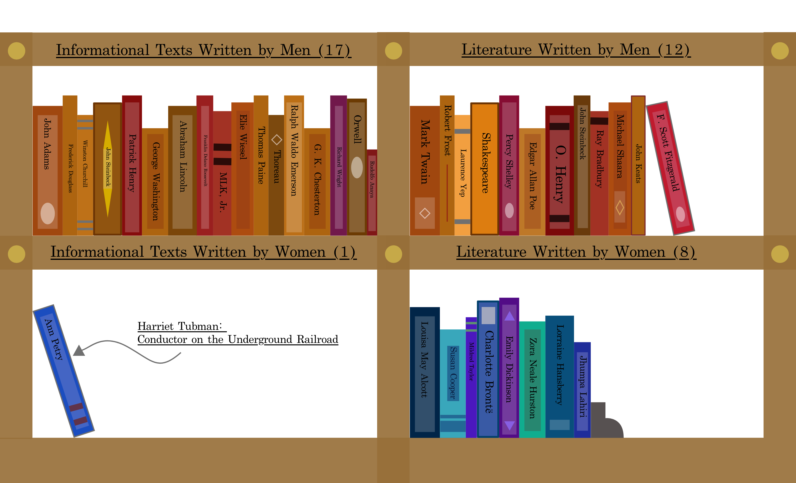

This personal project combined my interests of literature and data science. I took a look at Common Core English curriculum books taught in U.S. public schools and collected data on factors like the date published, gender of author, and popularity based on Goodreads rating. One main takeaway was that 26 percent of books were written by women (10/38) and 74 percent were written by men (28/38). I made a few data visualizations and wrapped the whole project up in a blog post.

Published in Towards Data Science, a Medium.com publication: [What Stories Do Schools Teach Us?](https://towardsdatascience.com/what-stories-do-schools-teach-us-43069c6dc040)
