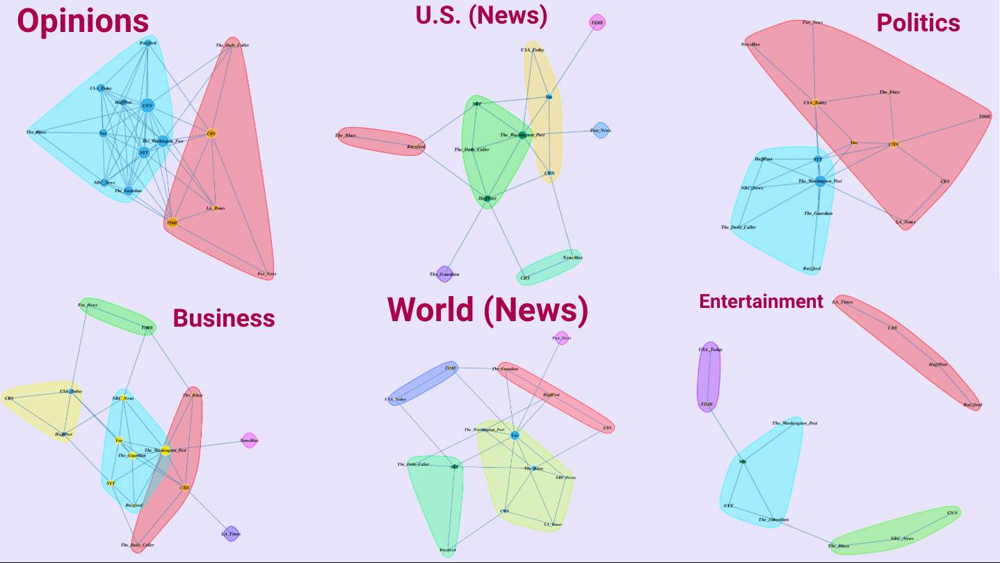

In this data science project, I applied network analysis to online news outlet citations. I was curious about which outlets referenced eachother, and how this might contribute to the phenomenon of echo chambers in media coverage. 

Published in Towards Data Science, a Medium.com publication:
[The Isolated Den of Fox News](https://towardsdatascience.com/the-isolated-den-of-fox-news-f31126e605cd)