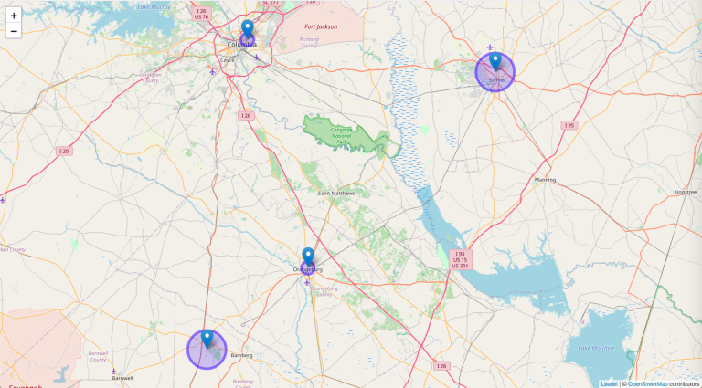

By pulling publicly available data from Snapchat's ad archive API, I uncovered an increase in activity on the platform by 2020 U.S. presidential candidates. This advertising activity often included microtargeting techniques. For example, Joe Biden's campaign geotargeted a particular ad to be shown near HBCU campuses.

Published on the Wesleyan Media Project's Delta Lab blog: [Presidential Advertising by Candidates Reveals Microtargeting Tactics on Snapchat](https://deltalab.research.wesleyan.edu/2020/10/28/presidential-advertising-on-snapchat/)
